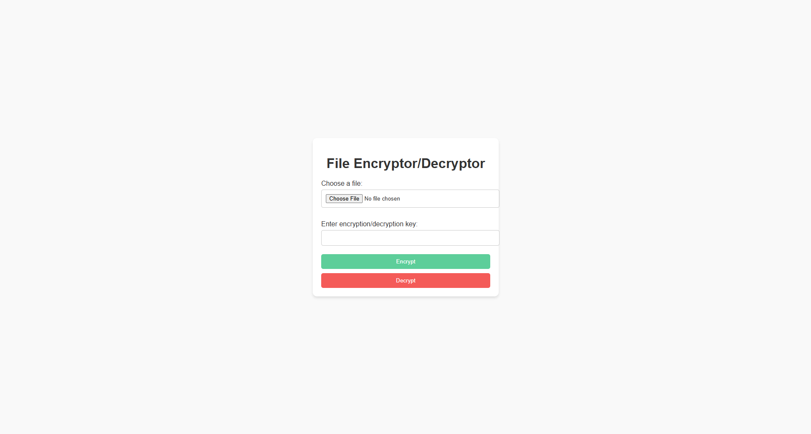
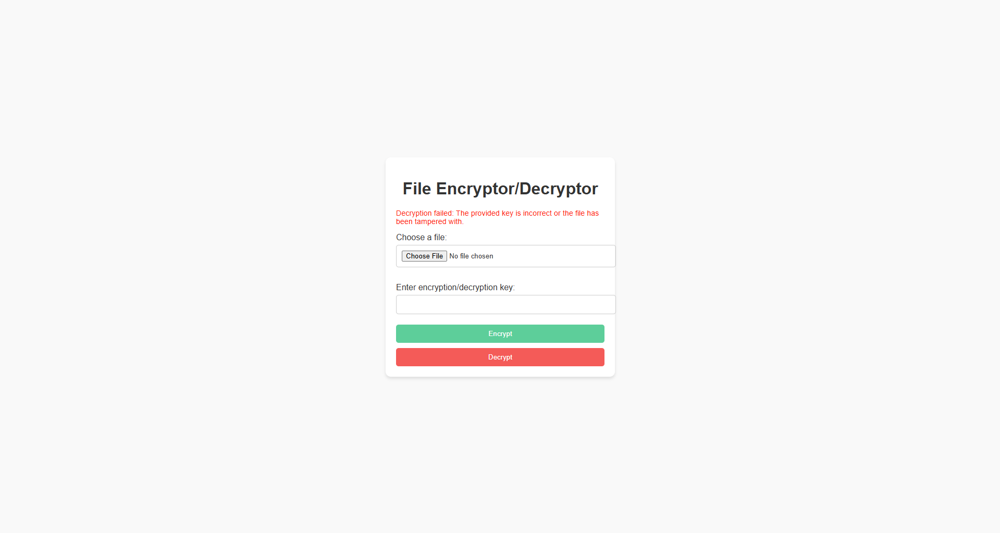

# File Encryptor/Decryptor

## Pendahuluan
Proyek mini ini adalah aplikasi web sederhana yang dibuat dengan Flask untuk memungkinkan pengguna mengenkripsi dan mendekripsi file menggunakan enkripsi AES-GCM. Aplikasi ini menjamin keamanan enkripsi dan dekripsi file sambil menyediakan antarmuka yang ramah pengguna.

## Fitur
- **Unggah File**: Pengguna dapat mengunggah file untuk dienkripsi atau didekripsi.
- **Enkripsi AES**: Menggunakan AES-GCM untuk enkripsi aman dengan autentikasi.
- **Masukan Kunci**: Pengguna dapat memasukkan kunci enkripsi/dekripsi mereka sendiri.
- **Penanganan Kesalahan**: Menampilkan pesan yang informatif saat dekripsi gagal karena kunci yang salah atau file yang rusak.
- **UI Responsif**: Tombol dengan warna pastel untuk meningkatkan kenyamanan pengguna.

## Memahami AES-GCM
### Apa itu AES?
AES (**Advanced Encryption Standard**) adalah algoritma enkripsi simetris yang sangat populer digunakan untuk mengamankan data. Algoritma ini bekerja pada ukuran blok tetap (128 bit) dan menggunakan kunci dengan ukuran 128, 192, atau 256 bit. AES cepat, efisien, dan menawarkan keamanan yang kuat, sehingga cocok untuk berbagai aplikasi.

### Apa itu GCM?
GCM (**Galois/Counter Mode**) adalah mode operasi untuk AES yang menyediakan:
1. **Kerahasiaan**: Memastikan bahwa data yang dienkripsi tidak dapat dibaca tanpa kunci yang benar.
2. **Integritas dan Autentikasi**: Memvalidasi bahwa data tidak dimodifikasi selama transmisi atau penyimpanan.

GCM menggunakan **authentication tag** untuk memverifikasi integritas data. Tag ini dihitung selama proses enkripsi dan diperiksa selama proses dekripsi untuk memastikan bahwa data tidak diubah.

### Panjang Kunci dan Tingkat Keamanan
AES-GCM mendukung tiga panjang kunci yang menentukan tingkat keamanannya:
1. **16 bytes (128 bits)**: AES-128, menawarkan tingkat keamanan standar dan performa lebih cepat.
2. **24 bytes (192 bits)**: AES-192, menyediakan tingkat keamanan yang lebih tinggi tetapi performa sedikit lebih lambat.
3. **32 bytes (256 bits)**: AES-256, menawarkan tingkat keamanan tertinggi dan cocok untuk data yang sangat sensitif.

Hubungan antara panjang kunci dan tingkat keamanan:
- **16 bytes** = 128 bits.
- **24 bytes** = 192 bits.
- **32 bytes** = 256 bits.

### Perlindungan terhadap Kunci yang Tidak Valid
AES-GCM tidak hanya mengenkripsi data tetapi juga menambahkan lapisan perlindungan dengan memastikan:
- **Validasi Authentication Tag**:
  - Selama proses dekripsi, authentication tag diperiksa terhadap data yang dienkripsi dan kunci yang diberikan.
  - Jika kunci salah atau data yang dienkripsi telah diubah, validasi akan gagal.
- **Tidak Ada Output Jika Gagal**:
  - Jika validasi gagal (karena kunci salah atau data yang dimodifikasi), AES-GCM tidak menghasilkan output apa pun. Hal ini mencegah penyerang mendapatkan wawasan tentang data yang dienkripsi, bahkan jika mereka mencoba menggunakan brute force atau kunci yang salah.
  - Perilaku ini membuat AES-GCM lebih aman dibandingkan mode lainnya seperti ECB (Electronic Codebook) atau CBC (Cipher Block Chaining).

Dalam proyek ini, jika kunci yang diberikan selama dekripsi salah, aplikasi akan menampilkan pesan kesalahan: 
```
Decryption failed: Incorrect key or the file has been tampered with.
```

Hal ini memastikan bahwa data tetap aman dan tidak dapat dibaca dalam kondisi yang salah atau berbahaya.

## Teknologi yang Digunakan
- **Backend**: Python, Flask
- **Frontend**: HTML, CSS
- **Library Enkripsi**: Cryptography

## Persyaratan
- Python 3.8 atau lebih tinggi
- Dukungan virtual environment (`venv`)

## Instalasi dan Pengaturan
1. Clone repository ini:
   ```bash
   git clone <repository-url>
   cd <repository-directory>
   ```

2. Buat dan aktifkan virtual environment:
   ```bash
   python -m venv .venv
   .\.venv\Scripts\activate
   ```

3. Perbarui `pip`:
   ```bash
   python -m pip install --upgrade pip
   ```

4. Instal dependensi:
   ```bash
   pip install -r requirements.txt
   ```

5. Jalankan aplikasi:
   ```bash
   python app.py
   ```

6. Buka browser Anda dan kunjungi:
   ```
   http://127.0.0.1:5000/
   ```

## Cara Penggunaan
### Mengenkripsi File
1. Unggah file menggunakan tombol "Choose File".
2. Masukkan kunci (16, 24, atau 32 karakter).
3. Klik tombol hijau "Encrypt".
4. Unduh file yang telah dienkripsi.

### Mendekripsi File
1. Unggah file yang telah dienkripsi menggunakan tombol "Choose File".
2. Masukkan kunci yang sama dengan yang digunakan untuk enkripsi.
3. Klik tombol merah "Decrypt".
4. Unduh file yang telah didekripsi.

### Catatan tentang Kunci
- Panjang kunci harus 16, 24, atau 32 karakter (sesuai dengan persyaratan AES).
- Jika kunci salah selama proses dekripsi, aplikasi akan menampilkan pesan kesalahan.

## Struktur Proyek
```
project/
├── app.py              # Aplikasi utama Flask
├── encryptor.py        # Logika enkripsi file
├── decryptor.py        # Logika dekripsi file
├── requirements.txt    # Dependensi proyek
├── static/             # File statis (CSS, gambar, dll.)
│   └── style.css       # CSS untuk styling UI
└── templates/          # Template HTML
    └── index.html      # Template UI utama
```

## Screenshot
### Antarmuka Enkripsi/Dekripsi
- Simple UI Testing 

- Invalid Key


## Lisensi
Proyek ini dilisensikan di bawah MIT License untuk penggunaan non-komersial. Lihat file [LICENSE](LICENSE) untuk detail lebih lanjut.

## Kontribusi
Silakan fork repository ini, kirimkan isu, atau kontribusikan ke proyek ini dengan membuat pull request.

## Kontak
Untuk pertanyaan atau masukan, silakan hubungi:
- **Penulis**: Wadagraprana
- **GitHub**: [Wadagraprana](https://github.com/Wadagraprana)