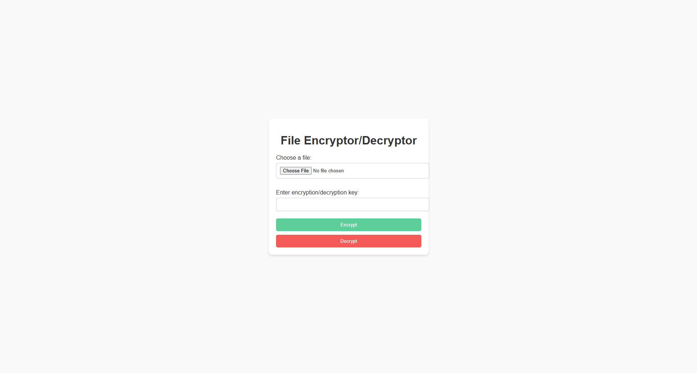
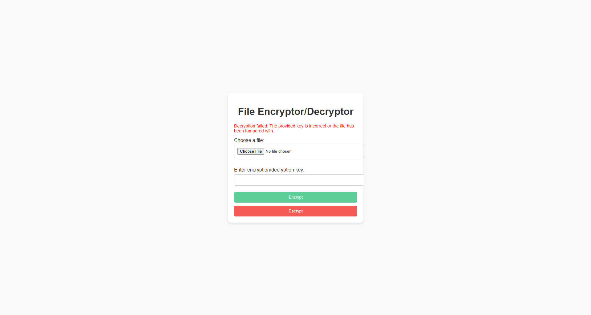

# File Encryptor/Decryptor

## Introduction
This mini project is a simple web application built with Flask that allows users to encrypt and decrypt files using AES-GCM encryption. It ensures secure file encryption and decryption while providing a user-friendly interface.

## Features
- **File Upload**: Users can upload files for encryption or decryption.
- **AES Encryption**: Utilizes AES-GCM for secure encryption with authentication.
- **Custom Key Input**: Users can provide their own encryption/decryption key.
- **Error Handling**: Displays meaningful messages when decryption fails due to incorrect keys or tampered files.
- **Responsive UI**: Buttons styled with pastel colors for better usability.

## Understanding AES-GCM
### What is AES?
AES (**Advanced Encryption Standard**) is a symmetric encryption algorithm widely used for securing data. It operates on fixed block sizes (128 bits) and uses keys of size 128, 192, or 256 bits. AES is fast, efficient, and offers strong security, making it suitable for various applications.

### What is GCM?
GCM (**Galois/Counter Mode**) is a mode of operation for AES that provides both:
1. **Confidentiality**: Ensures that the encrypted data cannot be read without the correct key.
2. **Integrity and Authentication**: Validates that the data has not been tampered with during transmission or storage.

GCM uses an **authentication tag** to verify data integrity. This tag is calculated during encryption and checked during decryption to ensure that the data has not been altered.

### Key Lengths and Security Levels
AES-GCM supports three key lengths which determine the level of security:
1. **16 bytes (128 bits)**: AES-128, offering a standard level of security and faster performance.
2. **24 bytes (192 bits)**: AES-192, providing a higher level of security but slightly slower performance.
3. **32 bytes (256 bits)**: AES-256, offering the highest level of security and suitable for highly sensitive data.

The relationship between key length and security is:
- **16 bytes** = 128 bits.
- **24 bytes** = 192 bits.
- **32 bytes** = 256 bits.

### Protecting Against Invalid Keys
AES-GCM goes beyond simple encryption by adding a layer of protection that ensures:
- **Authentication Tag Validation**:
  - During decryption, the authentication tag is checked against the encrypted data and the key provided.
  - If the key is incorrect or the encrypted data has been tampered with, the validation fails.
- **No Output on Failure**:
  - When the validation fails (due to an incorrect key or modified data), AES-GCM does not generate any output. This prevents attackers from gaining insights into the encrypted data, even if they try to use brute force or incorrect keys.
  - This behavior makes AES-GCM more secure compared to other modes like ECB (Electronic Codebook) or CBC (Cipher Block Chaining).

In this mini project, if the key provided during decryption is incorrect, the application displays an error message: 
```
Decryption failed: Incorrect key or the file has been tampered with.
```

This ensures that data remains secure and unreadable under incorrect or malicious conditions.

## Technologies Used
- **Backend**: Python, Flask
- **Frontend**: HTML, CSS
- **Encryption Library**: Cryptography

## Requirements
- Python 3.8 or higher
- Virtual environment (`venv`) support

## Installation and Setup
1. Clone this repository:
   ```bash
   git clone <repository-url>
   cd <repository-directory>
   ```

2. Create and activate a virtual environment:
   ```bash
   python -m venv .venv
   .\.venv\Scripts\activate
   ```

3. Upgrade `pip`:
   ```bash
   python -m pip install --upgrade pip
   ```

4. Install dependencies:
   ```bash
   pip install -r requirements.txt
   ```

5. Run the application:
   ```bash
   python app.py
   ```

6. Open your browser and visit:
   ```
   http://127.0.0.1:8000/
   ```

## Usage
### Encrypting Files
1. Upload a file using the "Choose File" button.
2. Enter a key (16, 24, or 32 characters long).
3. Click the green "Encrypt" button.
4. Download the encrypted file.

### Decrypting Files
1. Upload an encrypted file using the "Choose File" button.
2. Enter the same key used for encryption.
3. Click the red "Decrypt" button.
4. Download the decrypted file.

### Notes on Key Usage
- The key length must be 16, 24, or 32 characters (required by AES).
- If the key is incorrect during decryption, the application will display an error message.

## Project Structure
```
project/
├── app.py              # Main Flask application
├── encryptor.py        # File encryption logic
├── decryptor.py        # File decryption logic
├── requirements.txt    # Project dependencies
├── static/             # Static files (CSS, images, etc.)
│   └── style.css       # CSS for styling the UI
└── templates/          # HTML templates
    └── index.html      # Main UI template
```

## Screenshots
### Encryption/Decryption Interface
- Simple UI Testing 

- Invalid Key


## License
This project is licensed under the MIT License for non-commercial use. See the [LICENSE](LICENSE) file for more details.

## Contribution
Feel free to fork this repository, submit issues, or contribute to the project by creating pull requests.

## Contact
For questions or feedback, please reach out to:
- **Author**: Wadagraprana
- **GitHub**: [Wadagraprana](https://github.com/Wadagraprana)
